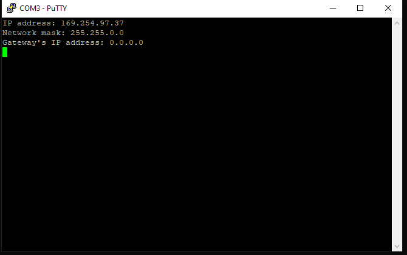
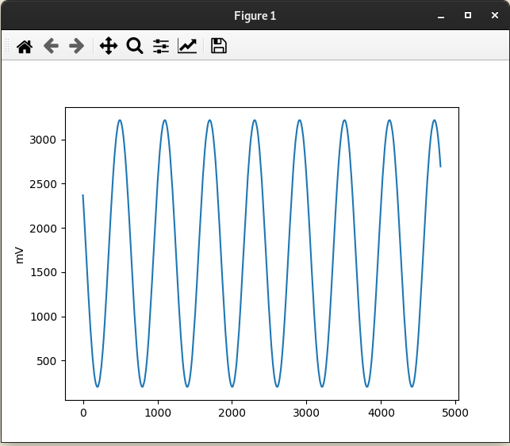

Note: For the moment, this project can only be built on Linux. In case you're using Windows, please skip to the **Programming the MCU** section and use the pre-built firmware binary.
# Prerequisites
Prior to building the project, a couple steps are necessary in order to get the Maxim Micros SDK and setup the environment. These are presented in the ***Build Prerequisites*** section of no-OS build guide available here: https://wiki.analog.com/resources/no-os/build .

The MaximSDK provides distributions of `arm-none-eabi-` GCC compiler + utilities and `OpenOCD`, so you don't have to install these separately.
# Getting the source code.

The firmware source files for the SWIOT project are available on Github on the following branch: https://github.com/analogdevicesinc/no-OS/tree/swiot.
To get the source code, first you'll have to clone the no-OS repository and checkout the SWIOT branch. This may be done by running the following commands:
1. `git clone --recursive https://github.com/analogdevicesinc/no-OS`
2. `cd no-OS`
3. `git checkout swiot`
4. `git submodule update --init` - Note: this is required in order to clone the lwip repository, which is not a sub-module on the master branch. Thus the `--recursive` flag in step 1  won't cover it.

# Building the project

1. You'll have to open a terminal/command line and navigate to the project's root directory, which is:
`no-OS/projects/swiot`.
2. Type `make -j`, in order to build the project.

A successful build should end with the following terminal output:
```
[11:11:27] [HEX] swiot.hex
[11:11:27] swiot.hex is ready
rm /home/xvr/MaximSDK_new/Libraries/CMSIS/Device/Maxim/MAX32650/Source/GCC/startup_max32650.s
[11:11:21] Done (build/swiot.elf)
```
The binary and executable files are now available in the `build` directory.
# Programming the MCU
Before the MCU can be programmed a few steps are necessary:
- Connect the MAXDAP board to the PC and the SWIOT board. If everything went well, you should see a mass storage device named `DAPLINK` in your filesystem.
- Power on the board, by providing 24V to the power connector. The polarity should be this one:

The microcontroller may be programmed in 2 ways:
1. Drag-and-drop the binary (.hex) file in the `DAPLINK` directory. The drive should be unmounted and mounted again, once the programming is done.
2. While in the project's root directory, type `make run`. This method uses OpenOCD in order to load the binary file. If the programming is successful, you should see the following terminal output:
```
** Programming Started **
** Programming Finished **
** Verify Started **
** Verified OK **
** Resetting Target **
shutdown command invoked
[11:27:42] swiot.elf uploaded to board
```
# Network connection

In order to configure and sample data from the SWIOT board, you'll have to connect it to a PC through the single pair Ethernet connector. There are a couple ways to do it:

1. Using a T1L -> Ethernet media converter:
- Direct connection to PC:
In case you don't have a DHCP server listening on the PC's network interface (to which SWIOT is connected), a link local address (in the 169.254.x.x\16 range will be used).

- Connection through a router:
In this case, you'll most likely have a DHCP server running on your router, which will assign an IP to your board.
 ```mermaid
graph LR
A[SWIOT T1L connector] -- SPE --> B[T1L -> Ethernet media converter]
B -- Ethernet --> C[Router]
D[PC] -- Ethernet --> C[Router]
```
3. Using a T1L -> USB media converter:
 ```mermaid
graph LR
A[SWIOT T1L connector] -- SPE --> B[T1L -> USB media converter]
B -- USB --> D[PC]
```

After the hardware connections are made, you'll have to power cycle the board.
In all these cases, once the TCP/IP software stack is fully configured and the board has an IP assigned to it (this will take ~10s if there is no DHCP server), there will be some information output to the serial interface (baudrate 115200 8N1):



Next, just to make sure that you can communicate with the board, you can try to ping the it using the IP address previously mentioned (either from command line or terminal).
In case the the ping resulted in a "destination unreachable" error, it may be the case that the PC's network interface is not correctly configure to route packets to the board's IP.
## Using the pyadi-iio script
The firmware is based on a no-OS implementation of the IIO framework from the Linux kernel, which offers similar functionalities. Thus, the board may be configured through the use of pyadi-iio API.

The steps are as following:
1. Clone the pyadi-iio repository: `git clone https://github.com/analogdevicesinc/pyadi-iio` 
2. Follow the installation steps provided in the pyadi-iio's README.md file: https://github.com/analogdevicesinc/pyadi-iio.
3. Update your `PYTHONPATH` environment variable to include the pyadi-iio's root directory.
In Windows you may do this by entering the `Environment Variables` window, and adding (or updating in case you already have it) the `PYTHONPATH` system variable.
In Linux you may open a terminal and either type `export PYTHONPATH=$PYTHONPATH:path/to/pyiio` (which will only be valid in the current terminal) or update your `~/.bashrc` file with the same line. If you chose the second option, you'll also have to type `source ~/.bashrc` to execute it for the current terminal.
4. Install `matplotlib` and `pandas` libraries, by running `pip install matplotlib pandas`.
5. Change the `dev_uri` variable in the `pyadi-iio/examples/swiot.py` to use the board's IP (previously printed on serial). The format should be like this: `dev_uri = "ip:169.254.97.37"`.
6. Type `python examples/swiot.py` in the pyadi-iio root directory to run the script. Please beware, this is going to configure and turn on the channels (depending on how they were configured by the script).

By default the output should be similar to this:


The channel functions may be changed using the `channel_enable`,  `channel_config` `and channel_device` lists. For example, the default configuration is:

```
"""
Possible values:
- max14906 selected as device: input, output
- ad74413r selected as device: voltage_out, current_out,
voltage_in, current_in_ext, current_in_loop,
resistance, digital_input, digital_input_loop,
current_in_ext_hart, current_in_loop_hart
"""
channel_config = ["voltage_in", "current_in_ext", "current_out", "output"]
# Possible values: 0, 1
channel_enable = [1, 1, 1, 1]
# Possible values: "ad74413r", "max14906"
channel_device = ["ad74413r", "ad74413r", "ad74413r", "max14906"]
```

This may be interpreted as such:
 - Channel 1: routed to the channel 1 of AD74413R, measuring the input voltage.
 - Channel 2: routed to the channel 2 of AD74413R, measuring the input current.
 - Channel 3: routed to the channel 3 of AD74413R, measuring the voltage resulted from the current limited output through the load connected on the channel's terminals.
 - Channel 4: routed to the channel 4 of MAX14906, configured as digital output.

The indexes in these lists correspond to the channel number. (0 is the first channel of the SWIOT, 1 is the second, and so on). 

When using these configuration lists, you don't have to worry about the case when 2 channels connected in parallel have "incompatible" functions (e.g both channel 1's of AD74413R and MAX14906 configured to output a voltage). When the channel of a device is configured, it's correspondent is placed in high impedance by the firmware.
 
 The available values for each channels are highlighted in the code snipped above.

Controlling the MAX14906:
-
The MAX14906 has the following channels:
 1. voltageX: either input or output depending on how it was configured. The `X` value is the index of the physical channel (starting from 0) of the SWIOT board.
	The channel has the following attributes:
	 - raw: either 0 or 1, representing the low/high state of a channel. The value of an output channel may be configured by writing this attribute: 
	
	`max14906.channels["voltage3"].raw = 1`
	or
	`max14906.channels["voltage3"].raw = 0`
	
	May also be read in both input and output configuration modes to monitor the state of the channel: 	 
	
	 `state = max14906.channels["voltage3"].raw`
	 - scale:  constant value of 1 (since the chip is a digital IO).
	 - offset: constant value of 0.
	 - current_limit: only available for output channels. May be set from a list of predefined values, you may get by reading the `current_limit_available` attribute. The values are provided as integers (current values in mA), and set as such:
		 
		`max14906.channels["voltage3"].current_limit = 130`
	 - current_limit_available: list of available values to be set for the `current_limit` attribute (mA values): `600`, `130`, `300`, `1200`.
	 - do_mode: only available for output channels. Configures the output driver for a specific channel. May be set from a list of predefined values, you may get by reading the `do_mode_available` attribute. May be set as such:
	 
		 `max14906.channels["voltage3"].do_mode = "High_side"`
	 - do_mode_available: list of available values to be set for the `do_mode` attribute: `High_side`, `High_side_2x_inrush`, `Push_pull_clamp`, `Push_pull`.
	 - IEC_type: only available for input channels.
	 - IEC_type_available: list of available values to be set for the `IEC_type` 
 2. voltage: input. This channel doesn't have an index, since it's used for fault reporting, and doesn't correspond to any physical channel of the SWIOT board.
	 The channel has the following attributes:
	  - raw: 32 bit value, each corresponding to a fault:
	  
| Bit | Description | Register        | Notes |
|-----|-------------|-----------------|-------|
| 31  | WDogErr     | GlobalErr(0x07) |       |
| 30  | LossGND     |                 |       |
| 29  | ThrmShutd   |                 |       |
| 28  | VDD_UVLO    |                 |       |
| 27  | VDD_Warn    |                 |       |
| 26  | VDD_Low     |                 |       |
| 25  | V5_UVLO     |                 |       |
| 24  | VINT_UV     |                 |       |
| 23  | VDDOV4      | ShtVDDChF(0x06) |       |
| 22  | VDDOV3      |                 |       |
| 21  | VDDOV2      |                 |       |
| 20  | VDDOV1      |                 |       |
| 19  | SHVDD4      |                 |       |
| 18  | SHVDD3      |                 |       |
| 17  | SHVDD2      |                 |       |
| 16  | SHVDD1      |                 |       |
| 15  | AboveVDD4   | OpnWirChF(0x05) |       |
| 14  | AboveVDD3   |                 |       |
| 13  | AboveVDD2   |                 |       |
| 12  | AboveVDD1   |                 |       |
| 11  | OWOff4      |                 |       |
| 10  | OWOff3      |                 |       |
| 9   | OWOff2      |                 |       |
| 8   | OWOff1      |                 |       |
| 7   | CL4         | OvrLdChF(0x04)  |       |
| 6   | CL3         |                 |       |
| 5   | CL2         |                 |       |
| 4   | CL1         |                 |       |
| 3   | OVL4        |                 |       |
| 2   | OVL3        |                 |       |
| 1   | OVL2        |                 |       |
| 0   | OVL1        |                 |       |
	  
Controlling the AD74413R:
 -
 Each channel of the AD74413R may be configured using one of these functions: `voltage_out, current_out,voltage_in, current_in_ext, current_in_loop, resistance, digital_input, digital_input_loop, current_in_ext_hart, current_in_loop_hart`. (write these to the `channel_config` list in the Python script).
The IIO channels of the device are generated based on the configurations done using the Python script.
The lists of input and output channels are printed when running the Python example. The input ones correspond to ADC channels, and output to DAC channels.
The channel names are dependent on whether they're configured to measure voltage, current or resistance. The index in the name corresponds to the index of the physical channel on the SWIOT board. 

The "value" of an output channel may be set as such:

```
ad74413r.channel["current1"].raw = 1000
```
The `raw` attribute's value corresponds to the DAC code for a specific channel. The value has to be in the range of 0 - 8191 (the DAC's resolution is 13 bits).

After the configuration step, the pyadi-iio example samples 4800 values (at a sampling rate of 4800) from one of the ADC channels (measuring voltage on channel 0). This is done by the following lines:

```
# The channels from which to sample the data. Should be one of the ADC channels.
ad74413r.rx_enabled_channels = ["voltage0"]
# The sample rate should be the same as what is set on the device (4800 is the default).
ad74413r.sample_rate =  4800
# The number of data samples. This may be changed accordingly.
ad74413r.rx_buffer_size =  4800
data = ad74413r.rx()
```

The channel from which the data is sampled may be changed to another input channel like this:
```
ad74413r.rx_enabled_channels = ["current0"]
```
Of course, in the example above, the channel 0 of the SWIOT has to be configured to measure current.
Finally, the sampled data is displayed on a plot.



