Wethlink no-OS Example Project for ADMV96S-WGBE-EK1 60 GHz Wireless Connector
=============================================================================     

Overview
--------

The :adi:`ADMV96S-WGBE-EK1` is a complete evaluation and
prototyping system for 60 GHz short data links. It consists of a pair of
receiver and transmitter boards with a 1 Gbps Ethernet interface on each side of
the wireless link.

The 60 GHz wireless link is implemented by the :adi:`ADMV9525` and
:adi:`ADMV9525` modules. These are coupled with a SerDes device
which translates the modules’ SGMII interface to RGMII so that it can be
connected to an ADIN1300 industrial low latency and low power 1 Gbps Ethernet
PHY. This enables each side of the wireless link to act as an Ethernet port and
essentially create a seamless wire-like connection between two ends of an
Ethernet cable.

The on-board :adi:`MAX32650` ultralow power ARM® Cortex®-M4
microcontroller controls the system’s operation and implements the algorithms to
configure the wireless link in real time so that optimal link quality is
constantly maintained over temperature and various operating conditions. An
open-source software stack is provided for firmware development as well as
reference applications. The MAX32650 can be programmed and debugged through a
JTAG SWD header which can also be used for connecting the Wethlink GUI
application to the board.

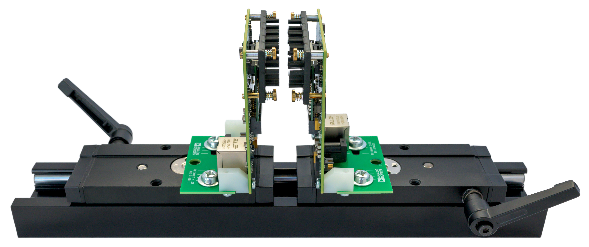

   ADMV96S-WGBE-EK1 Evaluation Kit

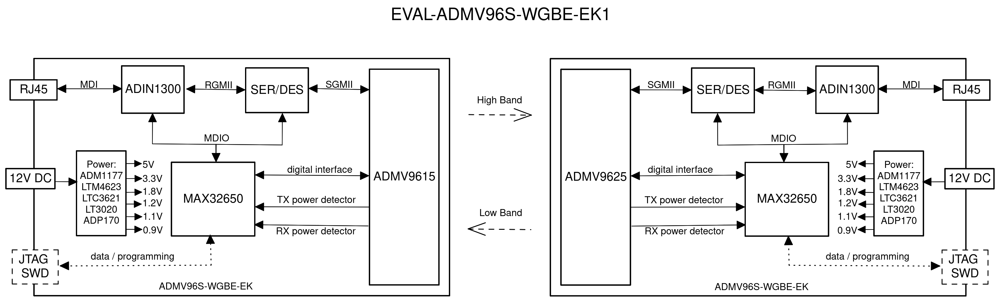

   ADMV96S-WGBE-EK1 Simplified Block Diagram

Features
--------

- Allows evaluation and prototyping of 60 GHz short data links to replace
  traditional mechanical connectors in moving joints
- 1 Gbps / 100 Mbps / 10 Mbps Ethernet interface on both sides of the wireless
  data link
- Fully programmable system allowing ultimate flexibility for custom
  developments
- Open-source software stack for firmware development
- Open-source GUI for system configuration, monitoring, and control

Applications
------------

- Slip rings
- Magnetic resonance imaging systems
- Autonomous Guided Vehicles
- Truck and trailer coupling
- Railway coupling

Specifications
--------------

+--------------------------+--------------------------------------------------+
| User Interfaces          |                                                  |
+==========================+==================================================+
| LEDs                     | Power status, TX and RX gain status, TX and RX   |
|                          | PLL lock status, Ethernet status                 |
+--------------------------+--------------------------------------------------+
| Connectivity             |                                                  |
+--------------------------+--------------------------------------------------+
| 10-pin Cortex SWD header | May be used with MAXDAP (MAX32625PICO) external  |
|                          | adapter for connecting the Wethlink GUI to the   |
|                          | evaluation board and for programming firmware.   |
+--------------------------+--------------------------------------------------+
| Ethernet                 | 1xRJ45 1 Gbps / 100 Mbps / 10 Mbps Ethernet port |
+--------------------------+--------------------------------------------------+
| Power supply             |                                                  |
+--------------------------+--------------------------------------------------+
| External power           | 12 VDC at 2A, 2.10 mm ID (0.083“), 5.50 mm OD    |
|                          | (0.217”) connector                               |
+--------------------------+--------------------------------------------------+
| Mechanical Specs         |                                                  |
+--------------------------+--------------------------------------------------+
| Dimensions               | 3.283 x 2.362                                    |
+--------------------------+--------------------------------------------------+

Package Contents
----------------

- 2x ADMV96x5 reference design boards
- ADMV9615
- ADMV9625
- 2x support PCBs
- 1x rail system
- 2x heatsinks
- 2x MAXDAP programmer
- 2x VEL36US120 power adapter
  *Users may need to purchase different adapter
  plugs to accommodate the various power socket standards 
  in different countries or regions*

Setting up the Hardware
-----------------------

.. figure:: assets/block_diagram_of_the_system.png

   System Block Diagram

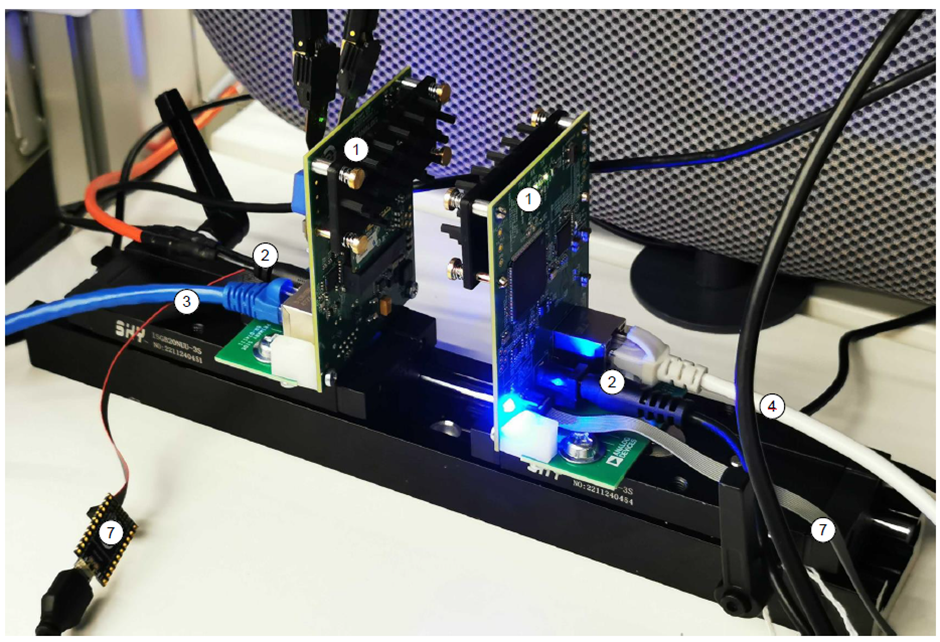

   ADMV96S-WGBE-EK1 Hardware Setup

Set up the hardware following these steps:

#. For both boards, make sure the S1 switch is in a position that corresponds to
   the label printed on the module inserted in P2. The wireless link will only
   work between an ADMV9615 and an ADMV9625 with the S1 switches correctly
   configured.
#. Mount the ADMV9615 and ADMV9625 assemblies onto the rail system as pictured
#. Connect CAT5 RJ45 Ethernet cables (3, 4) through the system (from a PC to a
   router, from a PC to another PC, etc.)
#. **Optionally**, connect the MAXDAP programmers (7) using micro-USB cables to
   your PC’s COM ports to be able to use the Wethlink GUI application*
#. Connect the 12V power supplies (2)

Connectors and Buttons
----------------------

.. grid::
   :widths: 50 50

   .. figure:: assets/front.png

      Front

   .. figure:: assets/back.png

      Back

+-----------+-----------------------------------------------------------------+
| Item Name | Function/Description                                            |
+===========+=================================================================+
| P1        | MAXDAP ADAPTER                                                  |
+-----------+-----------------------------------------------------------------+
| P2        | ADMV9615 or ADMV9625 connector                                  |
+-----------+-----------------------------------------------------------------+
| P14       | 12V DC Jack connector                                           |
+-----------+-----------------------------------------------------------------+
| J1        | RJ-45 Ethernet connector                                        |
+-----------+-----------------------------------------------------------------+
| S1        | ADMV9615/ADMV9625 switch, must be manually set to correct       |
|           | position when inserting a transceiver module in P2              |
+-----------+-----------------------------------------------------------------+
| S2        | Reset button, pressing it resets the MAX32650                   |
+-----------+-----------------------------------------------------------------+
| S3        | Reset to factory defaults, may be pressed during a reset (S2)   |
|           | to reset the board to factory default settings.                 |
+-----------+-----------------------------------------------------------------+

Power Supply
~~~~~~~~~~~~~

The ADMV96S-WGBE-EK1 kit contains two VEL36US120-US-JA 12V, 36W AC/DC external
wall mount (Class II) adapters. The board has a DC barrel jack connector
dedicated for power supply with the following mating dimensions: 2.10mm ID
(0.083“) and 5.50mm OD (0.217”). It accepts voltages between 4V and 16V, but
it is recommended to be supplied with 12V.

Power tree
^^^^^^^^^^

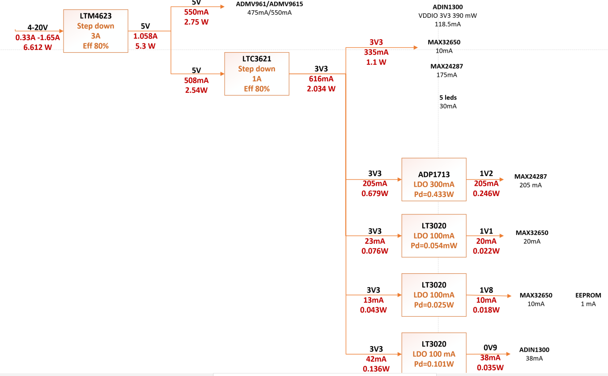

   Power Tree Diagram

The main DC/DC regulator is the :adi:`LTM4623`, designed for 5V
output. This will supply the ADMV96x5 and all the circuits on the
ADMV96S-WGBE-EK1 board. The LTM4623 supports selectable discontinuous mode
operation and output voltage tracking for supply rail sequencing. Its high
switching frequency and current mode control enable a very fast transient
response to line and load changes while providing very good stability.

The :adi:`LTC3621` synchronous step-down regulator is the next in
the power chain. The board uses the fixed version of this regulator but is
also designed to be compatible with the adjustable version. The 3V3 rail is
used to supply the PHY, MCU, and SerDes VDDIO, and is also used as an input
for the :adi:`ADP170` and :adi:`LT3020` linear regulators that generate the
lower voltage rails.

Status Indicators
^^^^^^^^^^^^^^^^^

+----------------------+----------------------+-------------------------------+
| Reference designator | Function/Description |                               |
+======================+======================+===============================+
| DS1                  | Power on LED         | indicates the board has       |
|                      |                      | powered up and 5V is in range |
+----------------------+----------------------+-------------------------------+
| D3                   | TX LED               | red indicates; green          |
|                      |                      | indicates                     |
+----------------------+----------------------+-------------------------------+
| D4                   | RX LED               | red indicates; green          |
|                      |                      | indicates                     |
+----------------------+----------------------+-------------------------------+
| DS3                  | TX LOCK LED          | lock status of TX             |
+----------------------+----------------------+-------------------------------+
| DS4                  | RX LOCK LED          | lock status of RX             |
+----------------------+----------------------+-------------------------------+
| J1                   | left side LED        | status of ADIN1300 (blinks    |
|                      |                      | when there is activity on the |
|                      |                      | link)                         |
+----------------------+----------------------+-------------------------------+
| J1                   | right side LED       | shows speed of the link:      |
|                      |                      | amber - 1 Gbps, green - 100   |
|                      |                      | Mbps, off - 10 Mbps           |
+----------------------+----------------------+-------------------------------+

Application Development
-----------------------

Example 1 – Demonstrate Gigabit Capability by Connecting to the Internet Using LAN with the Contactless 60 GHz Link
~~~~~~~~~~~~~~~~~~~~~~~~~~~~~~~~~~~~~~~~~~~~~~~~~~~~~~~~~~~~~~~~~~~~~~~~~~~~~~~~~~~~~~~~~~~~~~~~~~~~~~~~~~~~~~~~~~~

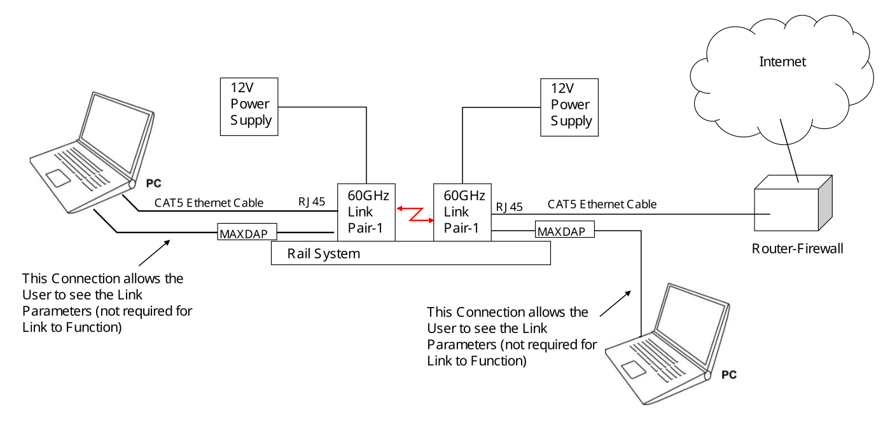

   ADMV9615 and ADMV9625 Contactless Ethernet Link Labeled Pair1 and Pair-2

Hardware Connections
^^^^^^^^^^^^^^^^^^^^

   Hardware Connections for Example 1

#. Mount the ADMV9615 and ADMV9625 Assemblies onto the guide rails with patch
   antennas facing each other.
#. Connect 12V power supplies.
#. Connect one RJ45 Ethernet connector to your PC.
#. Connect the other RJ45 Ethernet connector to your Local Area Network.
#. Turn off your PC’s Wi-Fi connection.
#. Within a few seconds, your PC should connect to your LAN with a speed of up
   to 1 Gbps (if your network can support it)
#. (Optional) Connect MAXDAP connector using a micro-USB to your PCs if you
   would like to configure the firmware.

Example 2 – Create a Two PC LAN Connected with the Contactless 60GHz Link and Share Large Data Files
~~~~~~~~~~~~~~~~~~~~~~~~~~~~~~~~~~~~~~~~~~~~~~~~~~~~~~~~~~~~~~~~~~~~~~~~~~~~~~~~~~~~~~~~~~~~~~~~~~~~

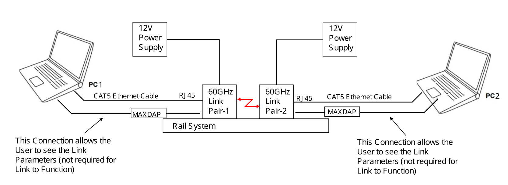

   ADMV9615 and ADMV9625 Contactless Ethernet Link Labeled Pair-1 and Pair-2

Hardware Connections
^^^^^^^^^^^^^^^^^^^^

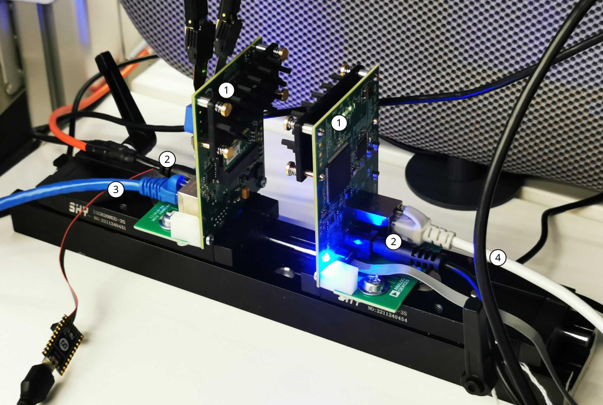

   Hardware Connections for Example 2

#. Mount the ADMV9615 and ADMV9625 assemblies onto the guide rails with patch
   antennas facing each other.

#. Connect 12V power supply, 2 PL.
#. Connect one RJ45 Ethernet connector to PC1’s Ethernet jack.
#. Connect the other RJ45 Ethernet connector to PC2’s Ethernet jack.

File Sharing Setup
^^^^^^^^^^^^^^^^^^

The following procedure was taken from:
`How to Share Files between Two Computers Using LAN Cable – TechWiser <https://techwiser.com/how-to-connect-pc-to-pc-lan-cable/>`_

- On PC1, go to the Start menu and search “Control Panel”. Once you see it,
  click on it, to open it.

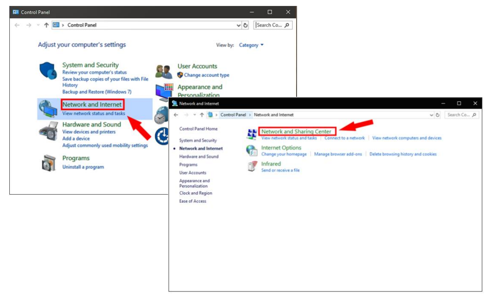

   File Sharing Setup

- Choose **Networks and Internet**.
- Next, choose **Network and Sharing Center**.
- Click on **Advanced Sharing Settings**.
- Choose **All Networks**.

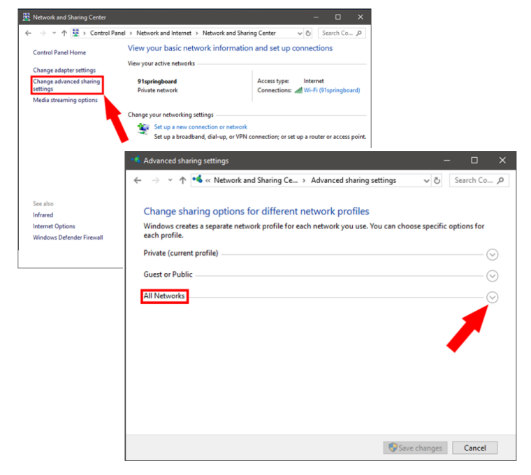

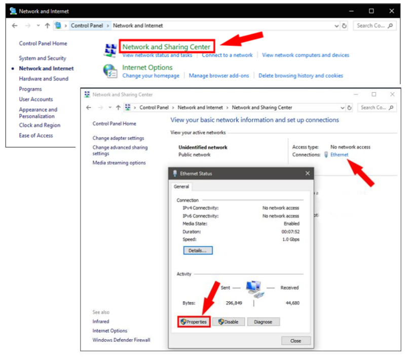

- Choose **Turn on Sharing**.

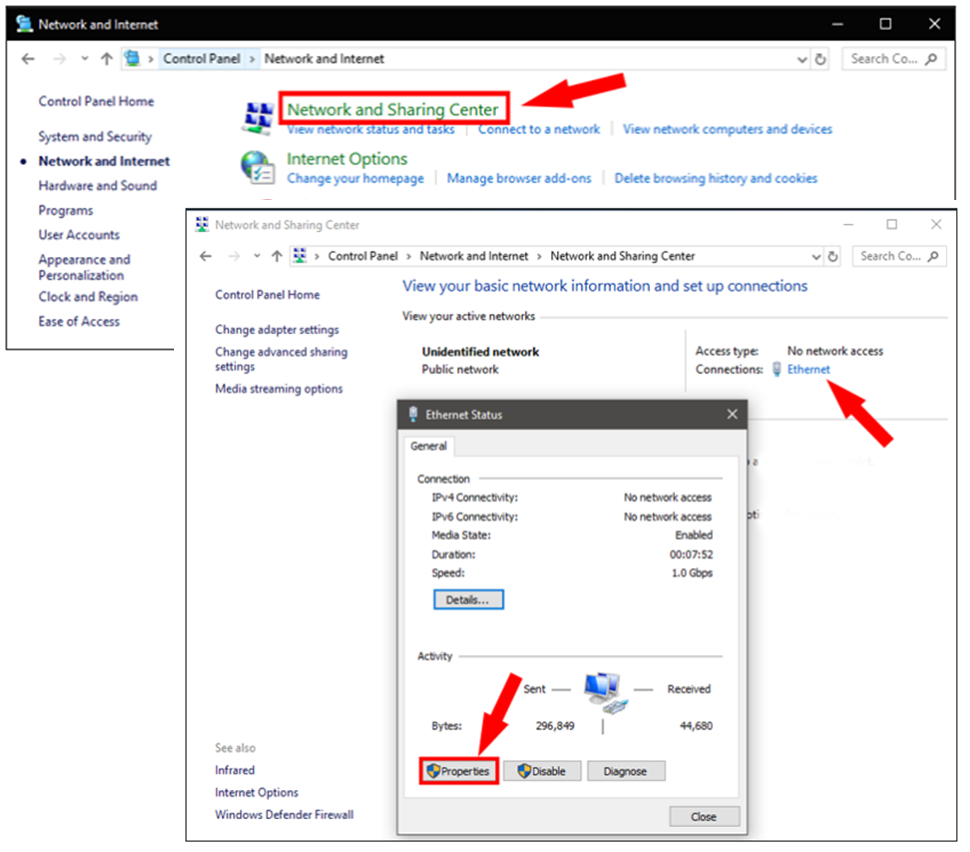

- Turn off Password Protection (Once Done with File Sharing Turn Password
  Protection Back On)
- Perform steps 2 through 6 for PC2.

To put both PCs on the same network, manually set up IP settings by opening
**Control Panel**.

- Choose **Network and Sharing**.
- Select **Ethernet** and click **Properties**.
- Select **Internet Protocol Version 4 (TCP/IPv4)**.
- Select **Properties**.

For PC1, choose “Use the following IP address”.

.. figure:: assets/ip_address.png

- IP Address: **192.168.1.1**
- Subnet mask: **255.255.255.0**
- Default Gateway: **192.168.1.2**

Use the following DNS server address:

- Preferred DNS Server: **208.67.222.222**
- Alternate DNS server: **208.67.220.220**

For PC2, choose “Use the following IP address”.

.. figure:: assets/pc2_ip_address.png

- IP Address: **192.168.1.2**.
- Subnet mask: **255.255.255.0**.
- Default Gateway: **192.168.1.1**.

Use the following DNS server addresses:

- Preferred DNS Server: **208.67.222.222**
- Alternate DNS Server: **208.67.220.220**

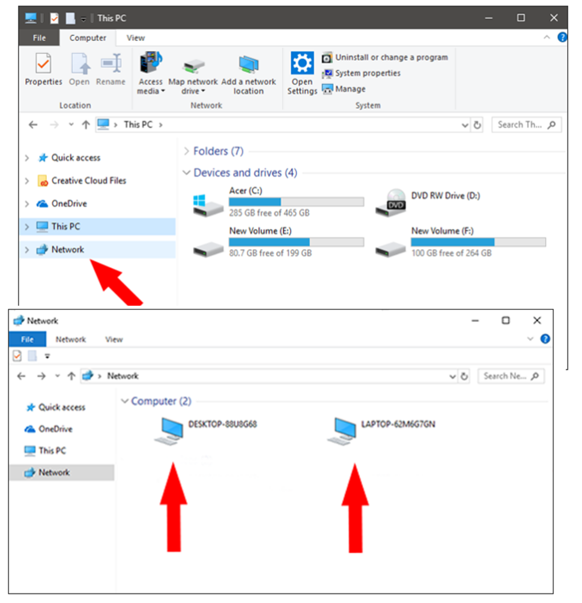

- Open Windows Explorer and click on the **Network** tab.
- If everything is set up properly, both computers should appear.
- You still need to share a target folder on the LAN.
- Create a new **folder** on the desktop and place some large files into it.

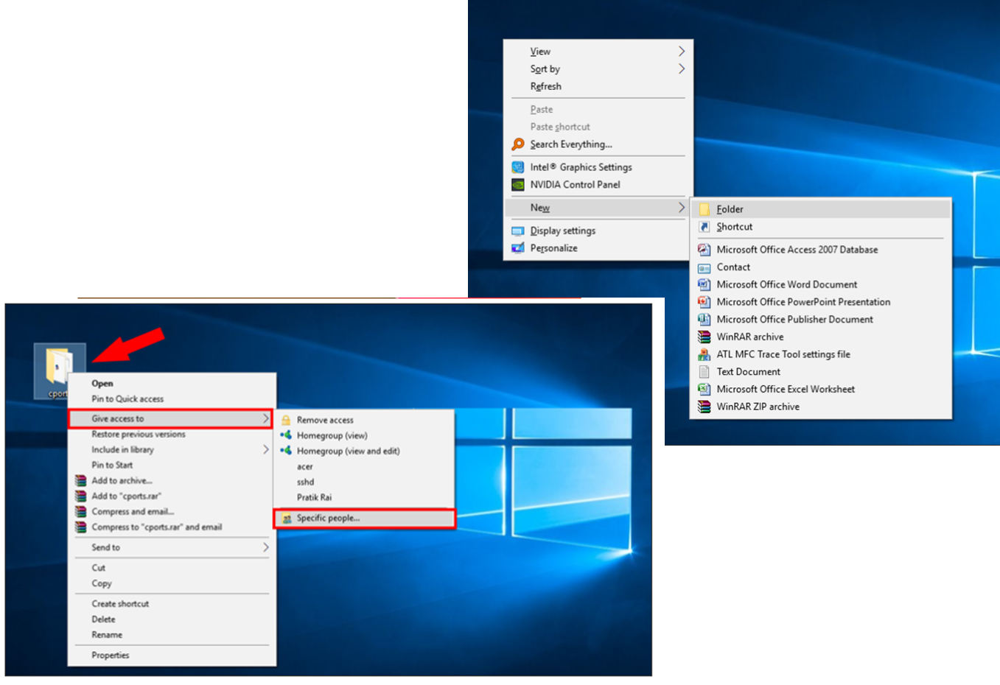

- Select the folder you want to share and right-click it.
- Choose **Everyone** and click **Add**.

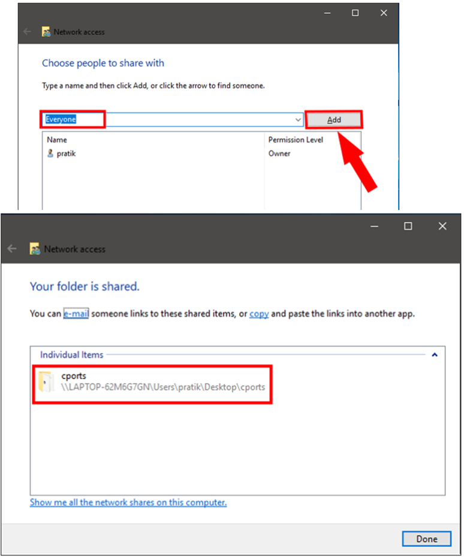

- Once shared, the next window will show the location of the folder.
- That’s it! Go back to the PC from which you want to access the file, open the
  **Networks** panel, and click on the other computer’s name.
- Here you will see the folder you just shared. Open the folder and
  transfer files and folders as you normally do—copy and paste, etc.
- You can repeat these steps from the other computer as well.

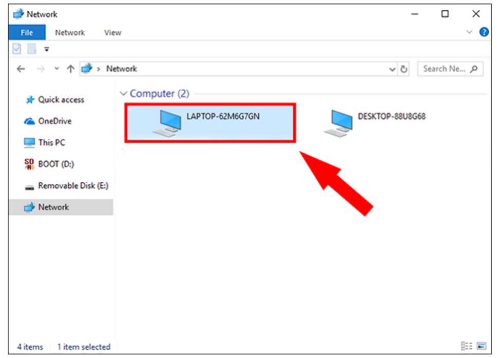

Example 3 – Use Iperf to Check Ethernet Link Speed
~~~~~~~~~~~~~~~~~~~~~~~~~~~~~~~~~~~~~~~~~~~~~~~~~~

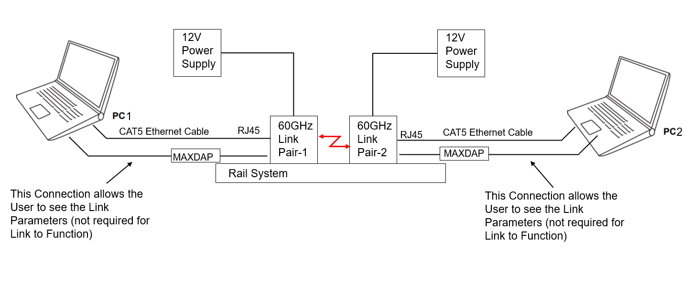

   ADMV9615 and ADMV9625 Contactless Ethernet Link Labeled Pair1 and Pair2

Hardware Connections
^^^^^^^^^^^^^^^^^^^^

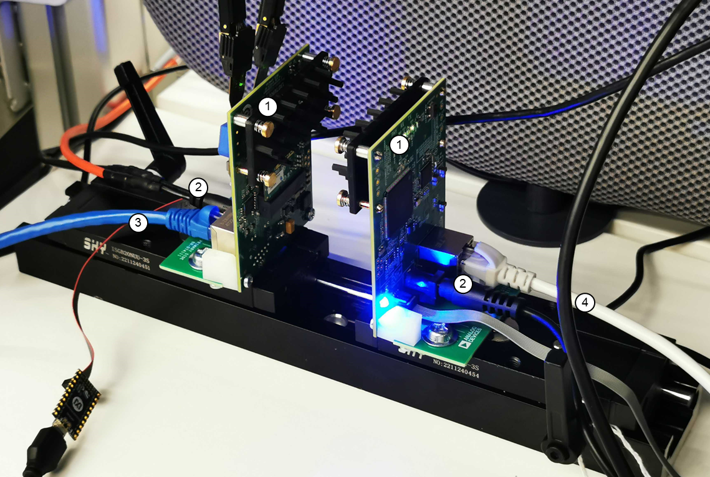

   Hardware Connections for Example 3

#. Mount the ADMV9615 and ADMV9625 assemblies onto the guide rails with patch
   antennas facing each other.
#. Connect 12V power supplies.
#. Connect one RJ45 Ethernet connector to PC1’s Ethernet jack.
#. Connect the other RJ45 Ethernet connector to PC2’s Ethernet jack.

Iperf
-----

Follow the Procedure from Example 2 for File Sharing Using a 2 PC LAN:

Iperf is a free tool for network performance and measurement,
`download it here <https://iperf.fr/iperf-download.php>`__

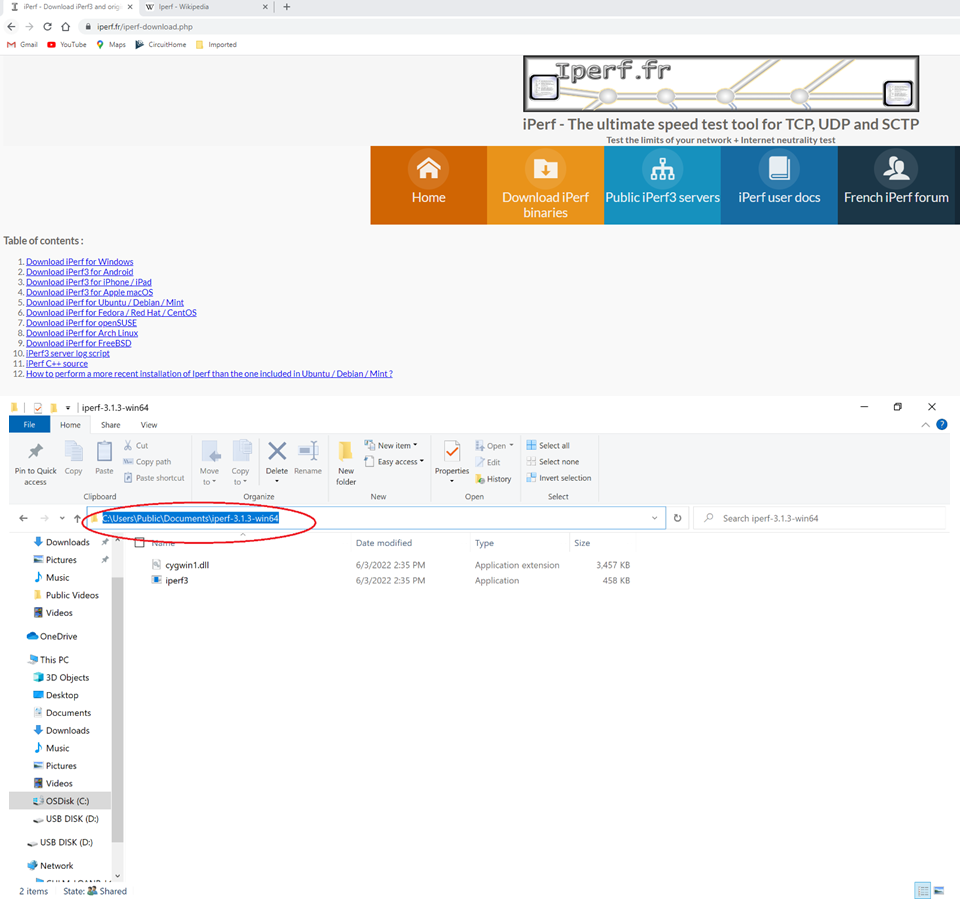

-   Unzip the downloaded archive.

-   On PC1, open a DOS Command window and navigate to the directory where iperf
    is installed:

    .. shell:: ps1

       $cd C:\Users\Public\Documents\iperf-3.1.3-win64

-   Set this computer as the server:

    .. shell:: ps1

       /c/Users/Public/Documents/iperf-3.1.3-win64
       $iperf3.exe -s

-   On PC2, open a DOS Command window and Navigate to the directory where iperf is
    installed:

    .. shell:: ps1

       $cd C:\Users\Public\Documents\iperf-3.1.3-win64

-   Set this computer as the client. Type in

    .. shell:: ps1

       /c/Users/Public/Documents/iperf-3.1.3-win64
       $iperf3.exe -c 192.168.1.1

    .. figure:: assets/iperf_settings.png

-   Iperf tests the link speed about 950 Mbps.

----

Evaluating the ADMV96S-WGBE-EK1 and Wethlink Example Project
-------------------------------------------------------------

The evaluation kit comes with the :adi:`MAX32650`
preprogrammed with a firmware that is ready to use as-is. If you’ve gone
through the hardware setup and you’ve connected at least the power and 
the Ethernet cables to the two boards of the setup, the firmware takes care of 
establishing and maintaining a wireless link automatically on power on.

Software Setup
---------------

``Wethlink`` GUI is an optional software that can be used to configure the
firmware operation from a PC. The firmware establishes a wireless link
automatically without any input from the Wethlink GUI. For a quick evaluation of
the ADMV96S-WGBE-EK1 you need not use the software at all. But if you want to
better observe or change the behavior of the firmware or want access to the raw
registers of the devices, you may use the software to achieve that, and this
page walks you through the installation process..

Requirements
------------

Windows
~~~~~~~

- `wethlink_installer.exe <https://swdownloads.analog.com/update/wethlink/latest/wethlink_installer.exe>`__

Linux
~~~~~

- git
- :ref:`libiio`
- python3
- pip

Installing the Wethlink GUI on Windows
~~~~~~~~~~~~~~~~~~~~~~~~~~~~~~~~~~~~~~

- To install the GUI double click the ``wethlink_installer.exe`` file. When
  prompted press ``Install`` and after the setup is completed press ``Close``.

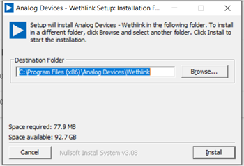

   Wethlink GUI Installation

- After installation the app is found at the path of the Destination Folder in
  the previous step.
- You can start the app by double clicking the ``wethlink.exe`` file in the
  destination folder or by launching it from the Windows start menu.

Running the Wethlink GUI on Linux
~~~~~~~~~~~~~~~~~~~~~~~~~~~~~~~~~

There is no installer provided on Linux, you have to clone the repo, install the
dependencies and run the app in python.

.. shell::

   $git clone https://github.com/analogdevicesinc/wethlink.git # TODO: does not exist yet
   $cd wethlink
   $pip install PyQt6 pyserial pylibiio
   $python wethlink.py

Firmware Installation
----------------------

How to find the firmware version?
~~~~~~~~~~~~~~~~~~~~~~~~~~~~~~~~~

Boot message
^^^^^^^^^^^^

When a board is powered up or reset with the RESET button, the firmware starts
executing and prints some messages over the serial port. You may access the
serial port by connecting a MAXDAP to the JTAG SWD header and to the PC. To view
the boot messages, open up a serial terminal application of your choice and
configure it to listen to the serial port that appears in your system when you
connect the MAXDAP to the PC (COMx on Windows, /dev/ttyACMx on Linux). The
serial port settings must be 115200 baud, 8 databits, no parity bits, 1 stopbit,
no flow control signals.

A typical boot message looks like this:

.. code-block::

   tags/wethlink-v1.0.0-7c98c2261 for revision B
   Transceiver: admv9625
   EEPROM: loading non-volatile parameters...
   EEPROM: loaded non-volatile parameters.
   Running IIOD server...

   If successful, you may connect an IIO client application by:
   1. Disconnecting the serial terminal you use to view this message.
   2. Connecting the IIO client application using the serial backend configured as shown:

       Baudrate: 345600
       Data size: 8 bits
       Parity: none
       Stop bits: 1
       Flow control: none

The firmware version is thus ``v1.0.0``, built using git commit ``7c98c2261``
for ``revision B`` hardware.

Using libiio from Command Line
~~~~~~~~~~~~~~~~~~~~~~~~~~~~~~

The ``libiio (v0.25 or later)`` library setup also installs some useful command
line tools such as ``iio_info`` which can connect to a remote ``iiod``
applciation and display information about it. In our case, the firmware is
running an ``iiod`` application, as can be seen in the boot message, so we can
query it over the serial port (replace /dev/ttyACM0 with COMn on Windows):

.. shell::

   $iio_info -u serial:/dev/ttyACM0,345600,8n1n
    iio_info version: 0.25 (git tag:v0.25)
    Libiio version: 0.25 (git tag: v0.25) backends: local xml ip usb serial
    IIO context created with serial backend.
    Backend version: 1.1 (git tag: 0000000)
    Backend description string: no-OS/projects/wethlink tags/wethlink-v1.0.0-7c98c2261
    [...]

We can conclude that the on-board firmware is ``v1.0.0`` built using git commit
``7c98c2261``.

Using Wethlink GUI
~~~~~~~~~~~~~~~~~~

Simply connect to the serial port of the device with the Wethlink GUI app and
observe the Context tab content.

How to Update the Firmware?
----------------------------

Drag and drop a .hex
~~~~~~~~~~~~~~~~~~~~

To update to a newer firmware version (`such as the latest
release <https://swdownloads.analog.com/update/wethlink/latest/revb-wethlink.hex>`__),
download the .hex file onto the DAPLINK drive that is created when you plug in
the programmer. While the file is being copied, you will see the MAXDAP device
blinking. Once the programming is done, the device reconnects again to the PC as
a DAPLINK drive. Check this newly attached DAPLINK drive for a FAIL.TXT file. If
it doesn’t exist, you have correctly programmed the board as in the following
video:

.. video:: https://wiki.analog.com/_media/resources/eval/user-guides/admv96s-wgbe-ek1/fw-update.webm

If however, there is a FAIL.TXT file, if might be that the programmer isn’t
connected correctly or that the firmware of the programmer itself is not a
firmware that can program a :adi:`MAX32650` target.
Here’s how a failed programming looks like:

.. video:: https://wiki.analog.com/_media/resources/eval/user-guides/admv96s-wgbe-ek1/fw-update-bad.webm

Is the MAXDAP firmware correct?
~~~~~~~~~~~~~~~~~~~~~~~~~~~~~~~~~

The MAXDAP itself needs to run a specific firmware version to be able to program
the MAX32650 with Drag and Drop. The DETAILS.TXT file on the DAPLINK drive
specifies the Git SHA of the running firmware:

.. code-block::

   Git SHA: 649f2a1524190c5f0ea32c97bb8682ad6fd772a0

If what you see on your device is not the one indicated above, please follow the
instructions on :git-max32625pico-firmware-images:`this page <#how-to-update-the-firmware+>`
to update the MAXDAP firmware first.

mcufla.sh
~~~~~~~~~

:git-no-OS:`/` provides a standalone script that can be used to program
.elf files to various targets, including the :adi:`MAX32650`. Typical usage
and output is shown below:

.. shell::

   $wget https://raw.githubusercontent.com/analogdevicesinc/no-OS/master/tools/scripts/mcufla.sh
   $chmod +x ./mcufla.sh
   $./mcufla.sh ~/Work/no-OS/projects/wethlink/build/wethlink.elf
    Maxim platform detected
    Running cmd:
      /home/dari/.mcuflash/maxim/openocd/src/openocd
        -s /home/dari/.mcuflash/maxim/openocd/tcl
        -c 'adapter driver cmsis-dap; transport select swd; '
        -f target/max32650.cfg
        -c 'program /home/dari/Work/no-OS/projects/wethlink/build/wethlink.elf verify reset exit'
    Open On-Chip Debugger 0.11.0+dev-g56a818e4c (2023-10-24-15:55)
    Licensed under GNU GPL v2
    For bug reports, read
        http://openocd.org/doc/doxygen/bugs.html
    swd
    Info : CMSIS-DAP: SWD  supported
    Info : CMSIS-DAP: Atomic commands supported
    Info : CMSIS-DAP: Test domain timer supported
    Info : CMSIS-DAP: FW Version = 2.1.0
    Info : CMSIS-DAP: Serial# = 042517028fbd037a00000000000000000000000097969906
    Info : CMSIS-DAP: Interface Initialised (SWD)
    Info : SWCLK/TCK = 1 SWDIO/TMS = 1 TDI = 0 TDO = 0 nTRST = 0 nRESET = 1
    Info : CMSIS-DAP: Interface ready
    Info : clock speed 2000 kHz
    Info : SWD DPIDR 0x2ba01477
    Info : max32xxx.cpu: Cortex-M4 r0p1 processor detected
    Info : max32xxx.cpu: target has 6 breakpoints, 4 watchpoints
    Info : max32xxx.cpu: external reset detected
    Info : starting gdb server for max32xxx.cpu on 3333
    Info : Listening on port 3333 for gdb connections
    target halted due to debug-request, current mode: Thread
    xPSR: 0x01000000 pc: 0x00000184 msp: 0x2000b300
    ** Programming Started **
    ** Programming Finished **
    ** Verify Started **
    ** Verified OK **
    ** Resetting Target **
    shutdown command invoked

make run
~~~~~~~~

This method involves installing the toolchain for building the
``projects/wethlink`` project and uploading the generated binary to the target
with ``make run``.

Hardware revision must be specified when building the wethlink project,
otherwise the build errors out. ``make HW_VERSION=0`` builds for rev A hardware,
and ``make HW_VERSION=1`` builds for rev B hardware.

.. note::
    For instructions on how to build the project, please refer to the
    :external+no-OS:doc:`build_guide`

Theory of Operation
-------------------

The firmware uses many no-OS modules for accessing the various peripherals it
needs for this project. The diagram below shows how these modules interact with
the hardware and with each other. Of particular interest is the feedback loop
from the embedded ADC that is periodically used to sample TX_DET and RX_DET at 1
Hz (provided by the embedded RTC) to the ``no_os_pid`` P.I.D. controller which
computes a new set of gain values that are written back into the transceiver.
This feedback loop is the core functionality of this system and it ensures that
the wireless link operates with optimum gains at any distance that the ADMV9615
and ADMV9625 are set apart.

.. figure:: wethlink-firmware.png
    :width: 600 px

    Firmware Block Diagram

A detailed view of this feedback loop is represented below, showing exactly what
gains the feedback loop controls:

.. figure:: algo.png
   :width: 600 px

   Feedback Loop Block Diagram

The firmware can also interact with a PC application over the serial line
(UART). Upon boot, it prints boot messages at 115200 baudrate, then launches an
``iiod`` application that can be accessed from a PC using ``libiio`` over a
serial backend at 345600 baudrate. The following existing PC applications may be
used to interact with the firmware:

#. ``iio_info``, ``iio_attr`` (command-line tools from :git-libiio:`Libiio` )
#. :ref:`IIO Oscilloscope <iio-oscilloscope>`
#. `Wethlink GUI <https://swdownloads.analog.com/update/wethlink/latest/wethlink_installer.exe>`__ (Windows only)

The fact that the firmware exposes the on-board devices as iio devices in a
`standardized way <https://www.kernel.org/doc/html/v4.12/driver-api/iio/index.html>`__
means that it is easy to devise new applications that can interact with the
firmware by simply using the :ref:`libiio` library.

IIO devices
~~~~~~~~~~~

You can see all the iio devices and their channels and attributes below, as
obtained with ``iio_info``:

.. shell::

   $iio_info -u serial:/dev/ttyACM0,345600,8n1n
    iio_info version: 0.25 (git tag:v0.25)
    Libiio version: 0.25 (git tag: v0.25) backends: local xml ip usb serial
    IIO context created with serial backend.
    Backend version: 1.1 (git tag: 0000000)
    Backend description string: no-OS/projects/wethlink tags/wethlink-v1.0.0-rc1-7c98c2261
    IIO context has 9 attributes:
        hw_model: admv9625
        hw_version: b
        hw_serial: serial
        carrier_model: model
        carrier_version: b
        carrier_serial: serial
        uri: serial:/dev/ttyACM0,345600,8n1n
        serial,port: /dev/ttyACM0
        serial,description: DAPLink CMSIS-DAP - 042517028fbd037a00000000000000000000000097969906
    IIO context has 6 devices:
        iio:device0: hmc6300
            1 channels found:
                temp:  (input)
                1 channel-specific attributes found:
                    attr  0: raw value: 15
            8 device-specific attributes found:
                    attr  0: enabled value: 1
                    attr  1: vco value: 59850000
                    attr  2: vco_available value: 55125000 55387500 55650000 55912500 56175000 56437500 56700000 56962500 57225000 57487500 57750000 58012500 58275000 58537500 58800000 59062500 59325000 59587500 59850000 60112500 60375000 60637500 60900000 61162500 61425000 61687500 61950000 62212500 62475000 62737500 63000000 63262500 63525000 63787500 64050000 64312500 64575000 64837500 65100000 65362500 65625000 65887500 66150000
                    attr  3: vco_band value: 8
                    attr  4: vco_lock value: 1
                    attr  5: if_attn value: 15
                    attr  6: temp_en value: 1
                    attr  7: rf_attn value: 9
            1 debug attributes found:
                    debug attr  0: direct_reg_access value: 0
            No trigger on this device
        iio:device1: hmc6301
            1 channels found:
                temp:  (input)
                1 channel-specific attributes found:
                    attr  0: raw value: 15
            14 device-specific attributes found:
                    attr  0: enabled value: 1
                    attr  1: vco value: 63262500
                    attr  2: vco_available value: 55125000 55387500 55650000 55912500 56175000 56437500 56700000 56962500 57225000 57487500 57750000 58012500 58275000 58537500 58800000 59062500 59325000 59587500 59850000 60112500 60375000 60637500 60900000 61162500 61425000 61687500 61950000 62212500 62475000 62737500 63000000 63262500 63525000 63787500 64050000 64312500 64575000 64837500 65100000 65362500 65625000 65887500 66150000
                    attr  3: vco_band value: 15
                    attr  4: vco_lock value: 1
                    attr  5: if_attn value: 6
                    attr  6: temp_en value: 1
                    attr  7: rf_lna_gain value: 1
                    attr  8: bb_attn1 value: 0
                    attr  9: bb_attn2 value: 0
                    attr 10: bb_attni_fine value: 0
                    attr 11: bb_attnq_fine value: 0
                    attr 12: bb_lpc value: 0
                    attr 13: bb_hpc value: 0
            1 debug attributes found:
                    debug attr  0: direct_reg_access value: 0
            No trigger on this device
        iio:device2: mwc
            2 channels found:
                voltage0: tx_det (input)
                2 channel-specific attributes found:
                    attr  0: raw value: 257
                    attr  1: scale value: 1.191406250
                voltage1: rx_det (input)
                2 channel-specific attributes found:
                    attr  0: raw value: 596
                    attr  1: scale value: 2.978515625
            10 device-specific attributes found:
                    attr  0: tx_autotuning value: 1
                    attr  1: tx_target value: 350
                    attr  2: tx_tolerance value: 50
                    attr  3: rx_autotuning value: 1
                    attr  4: rx_target value: 1950
                    attr  5: rx_tolerance value: 50
                    attr  6: tx_auto_ifvga value: 1
                    attr  7: rx_auto_ifvga_rflna value: 1
                    attr  8: reset value: 0
                    attr  9: save value: 0
            1 debug attributes found:
                    debug attr  0: direct_reg_access value: 1
            No trigger on this device
        iio:device3: adin1300
            0 channels found:
            3 device-specific attributes found:
                    attr  0: link value: 0
                    attr  1: speed value: 6
                    attr  2: autonegotiate value: 1
            1 debug attributes found:
                    debug attr  0: direct_reg_access value: 4416
            No trigger on this device
        iio:device4: max24287
            0 channels found:
            3 device-specific attributes found:
                    attr  0: par_speed value: 5
                    attr  1: ser_link value: 1
                    attr  2: ser_speed value: 5
            1 debug attributes found:
                    debug attr  0: direct_reg_access value: 0
            No trigger on this device
        iio:device5: adm1177 (buffer capable)
            2 channels found:
                voltage0:  (input, index: 0, format: le:u12/32>>0)
                2 channel-specific attributes found:
                    attr  0: raw value: 1901
                    attr  1: scale value: 6.433105468
                current0:  (input, index: 1, format: le:u12/32>>0)
                2 channel-specific attributes found:
                    attr  0: raw value: 358
                    attr  1: scale value: 1.033593750
            No trigger on this device

The context contains information that is provisioned at manufacturing such as
serial number, hardware revision, or information produced during the build
process such as the firmware version. The ADMV9615 or ADMV9625 DIP switch state
is also exposed as a context attribute and the firmware makes certain decisions
based on it.

There are 6 exposed devices:

#. ``hmc6300`` - the transmitter or the ADMV96x5 module
#. ``hmc6301``- the receiver of the ADMV96x5 module
#. ``mwc`` - this device exposes attributes and channels that are specific to
   this project, such as the ``tx_det`` and ``rx_det`` ADC channels, attributes
   to enable/disable automatic gain control, attributes to write settings to
   non-volatile memory etc. (read “mwc” as “microwave connector”)
#. ``adin1300`` - the Ethernet PHY
#. ``max24287`` - the RGMII to SGMII Serializer/Deserializer
#. ``adm1177`` - the input power monitor

LED
~~~

Each ADMV96S-WGBE-EK reference design board has a few LED’s to convey
information from the firmware to the user.

The blue LED is a *power good* LED and it only lights up if the input power is a
clean 12V.

The 4 LED series at the top of the board convey the following information:

+------------------+------------------+------------------+------------------+
| RX               |                  | TX               |                  |
+==================+==================+==================+==================+
| DET_OUT          | RX_LOCK          | DET_OUT          | TX_LOCK          |
+------------------+------------------+------------------+------------------+
| Lit (green or    | Lit when RX VCO  | Lit (green or    | Lit when TX VCO  |
| red) when RX     | has locked.      | red) when TX     | has locked.      |
| autotuning is    |                  | autotuning is    |                  |
| on, otherwise    |                  | on, otherwise    |                  |
| not lit. Green   |                  | not lit. Green   |                  |
| when RX_DET is   |                  | when TX_DET is   |                  |
| within tolerance |                  | within tolerance |                  |
| of the target.   |                  | of the target.   |                  |
| Red when RX_DET  |                  | Red when TX_DET  |                  |
| is not within    |                  | is not within    |                  |
| tolerance of the |                  | tolerance of the |                  |
| target.          |                  | target.          |                  |
+------------------+------------------+------------------+------------------+

The following examples shows a board that has TX and RX VCO’s locked, TX and RX
autotuning on, TX_DET within tolerance of target but the firmware can’t keep
RX_DET within tolerance of target. To force this error, one of the boards facing
each other was unplugged so the photographed board was trying to maximize the RX
gains to receive something meaningful. But if there is no incoming signal, gain
changes cannot possibly affect RX_DET so the firmware lights up the LED in red.

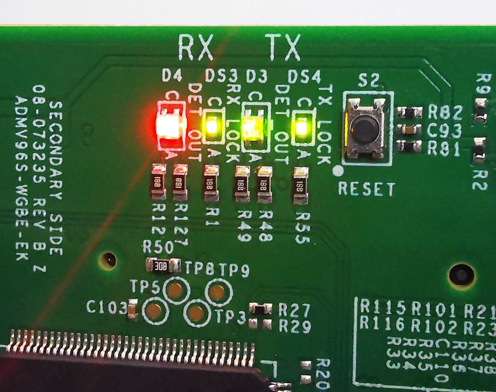

   LED Indicators

The RJ45 connector also has embedded LED’s. The top left one lights up green
when the ADIN1300 has connected to another PHY over the Ethernet cable. This LED
is briefly turned off when there is activity on the Ethernet cable essentially
blinking it. So a blinking top left LED means both the Ethernet link is up and
there is ongoing activity. The top right LED conveys link speed information and
is turned off when link speed is 10 Mbps, lit green for 100 Mbps and lit amber
when speed is 1000 Mbps.

EEPROM
~~~~~~

The 24LC32A EEPROM has 32Kb memory capacity (4 KB) and is connected to an I2C
bus. The firmware uses the EEPROM to store non-volatile parameters to be loaded
at boot.

In order not to waste space, and to make sure future iterations of the firmware
may use areas of the EEPROM that are currently unused, a design decision had to
be made from the start, as to what size a non-volatile parameter set should
have. A reasonable size of 256 bytes was chosen, which makes it possible to fit
16 such parameter sets into the memory.

======= ================ ====
Address Name             Size
======= ================ ====
0x0     NVMP1            256
0x100   Reserved         3584
0xF00   Factory defaults 256
======= ================ ====

Two such areas are currently used by the firmware, one is the NVMP1 area which
is the active configuration loaded at boot and the other one is the factory
defaults configuration which can be copied into the active configuration with a
certain procedure.

The 0x100 to 0x3FF memory area is not used.

Each NVMP area has 255 bytes of actual parameters and 1 last byte consisting of
a CRC8 computed over the leading 255 bytes.

The CRC8 checksums are checked at boot and if they have been incorrectly written
or tampered with, the parameters are not used. If no suitable parameters are
found in NVMP1 or in the factory defaults area, a set of in-firmware hardcoded
parameters are used for the boot.

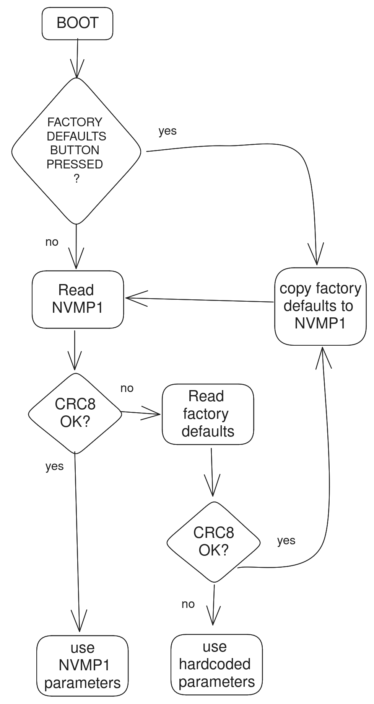

   EEPROM Memory Map

Resetting to factory defaults
~~~~~~~~~~~~~~~~~~~~~~~~~~~~~

To explicitly reset to factory defaults, click the S3 button, keep it pressed
and click the S2 button briefly. The four LED’s will blink 10 times for about 3
seconds to confirm the reset to factory defaults has completed.

Production firmware and provisioning
~~~~~~~~~~~~~~~~~~~~~~~~~~~~~~~~~~~~

There are two versions of the firmware that are for *normal* and *production*
use.

The *normal* firmware is the one that runs on the hardware, provided the
hardware had gone through the production process fully. The production process
has 3 main steps: actual hardware production, provisioning and testing.

The *production* firmware is a variant that has the following extra features:

- It disregards whatever is in the EEPROM and loads up with hardcoded
  parameters.
- It allows writing of the factory defaults area of the EEPROM by exposing the
  ``mwc.save_defaults`` attribute.
- It allows provisioning by allowing the change of the serial number
  (``mwc.hw_serial``, ``mwc.carrier_serial``), revision (``mwc.hw_version``,
  ``mwc.carrier_version``) and model name (``mwc.carrier_model``) which all
  default to ``-`` when the device is not provisioned.

With a *normal* firmware, the device will not behave correctly if it was not
provisioned. The firmware needs valid parameters to operate correctly so having
``-`` being displayed as carrier serial number is an indicator that the device
hasn’t somehow gone through the full production cycle that performs
provisioning.

Autonegotiation
~~~~~~~~~~~~~~~

The EVAL-ADMV96S-WGBE-EK1 is a system composed of two independent boards that
connect to the *outside* world through Ethernet. The network infrastructure at
the other end of the Ethernet cable is not known yet the system can detect its
capabilities in terms of data bandwidth and dulplex mode due to autonegotiation
signaling at physical layer (OSI model).

The system may be connected at any time to devices on a network that have
different capabilities. The device at one end could be able to talk 100 Mbps
half-duplex, the one at the other end could be capable of 1 Gbps full-duplex. In
this scenario, the system needs to adapt for the weakest link and configure the
100 Mbps half-duplex speed at all levels, it’s the common denominator that
allows the two devices to talk to each other.

Having two independent devices in a system, each running its own firmware, this
could only be possible if there is some mechanism through which the devices
could advertise speeds to one another. The wireless link carries SGMII interface
and the SGMII itself has an autonegotiation mechanism through which a frame
containing speed and duplex information can be passed on from one device to the
other. The firmware uses this feature to propagate an Ethernet link speed change
throughout the whole system.

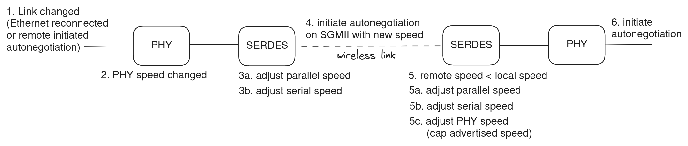

   Autonegotiation Flow

Steps 1-4 are executed in an interrupt service routine from the PHY when link
status changes.

Steps 5-6 are executed in an interrupt service routine from the SERDES when new
autonegotiation page was received.

To resume this section:

- there is speed and duplex mode autonegotiation at Ethernet level
- there is speed and duplex mode autonegotiation at SGMII level
- the lowest advertised speed of a device in the system is propagated and the
  system subsequently works at that speed

Temperature Compensated Gains
~~~~~~~~~~~~~~~~~~~~~~~~~~~~~

Due to reasons related to the transceiver hardware, the optimum gains at which
it operates are temperature dependent. Affected gains are TX IF VGA, RX IF VGA
and RX RF LNA. The optimum gains found through lab characterization are provided
by Analog Devices.

The transceivers have a very coarse temperature sensor that is used by the
firmware to look up gains in a lookup table. The default behavior of the
firmware is to auto compensate gains for temperature using the factory default
lookup tables.

You can disable auto compensation by unticking the checkbox, or you can keep it
and adjust the tables to your liking.

TX temperature compensation table:

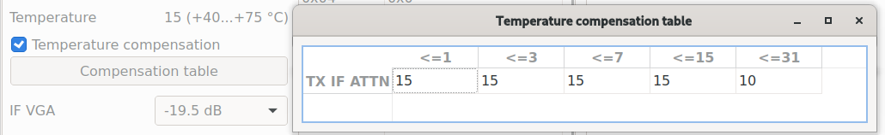

    TX temperature compensation table

RX temperature compensation table:

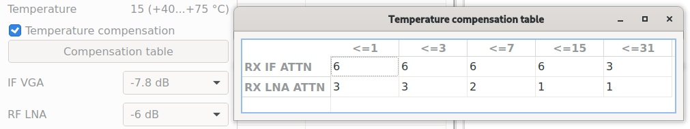

    RX temperature compensation table

======== =============
Raw Temp Range
======== =============
1        -40°C … -25°C
3        -25°C … 10°C
7        10°C … 40°C
15       40°C … 75°C
31       >75°C
======== =============

P.I.D. Controlled Gains
~~~~~~~~~~~~~~~~~~~~~~~

TX_DET and RX_DET analog signals of the transceivers are sampled regularly by
the embedded ADC of the microcontroller. They correspond to the TX and RX signal
power and need to be kept in a certain sweetspot for proper operation of the
wireless link.

The remaining gains, that aren’t temperature controlled, are the TX RF VGA and
the RX BB (COARSE1, COARSE2, and FINE). By controlling these gains up and down,
one can see a change in the RX and RX power detectors.

So we have a feedback loop and we can apply control theory on it in the form of
a P.I.D. algorithm to keep the TX_DET and RX_DET in the sweetspot by having the
algorithm tweak the gains. The implementation actually only uses the
proportional and integral coefficients, essentially making this a P.I. control.

Every second the algorithm is run for several iterations until it settles on a
resulting gain. There are two challenges:

#. Make it settle fast! We don’t care too much about overshoot, we care about
   settling fast because the algorithm is run on the main loop along with other
   things and we don’t want to block for too long.
#. Make it settle with as little gain changes as possible! Any gain change will
   momentarily mess with the signals being sent in that instant across the
   wireless link, so by minimizing the gain changes, we minimize the bit error
   rate throughout the whole system.

To illustrate how the algorithm works, here’s the result of a simulation with
artificial perturbations at samples 100, 200, 300, and 400 in order to observe
the characteristics of the control. The top part shows the output of the P.I. as
an attenuation in steps between 0 and 31. The bottom part is a simulated RX_DET
(mV) based on what attenuation the algorithm previously set.

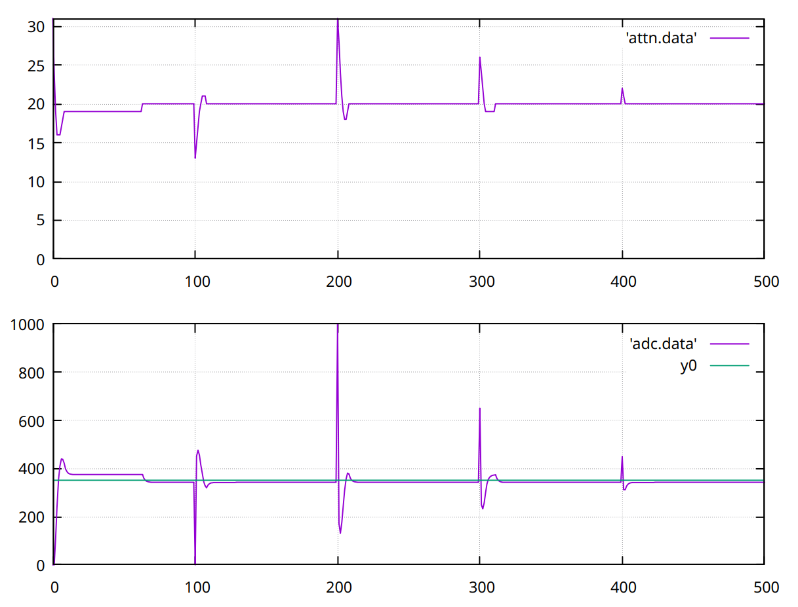

   P.I.D. Control Simulation

With the factory default settings, the algorithm finds the target within 10
iterations or less and does it with few gain changes addressing both of the
above points. As with any P.I.D. algorithm, it’s possible that better behavior
is achievable by experimentally fine tuning the coefficients but with the
factory default coefficients and initial release implementation, the system
achieves a bit error rate of less than 10E-10 for constant distance and across
the whole -40°C to 80°C.
